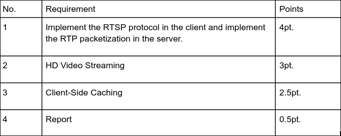
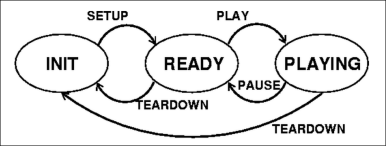

# Project Socket Programming - Video Streaming with RTSP and RTP

## Thông tin sinh viên

**24120098** - *Nguyễn Quốc Nam*

**24120123** - *Võ Hoàng Phúc*

**24120469** - *Chế Nguyễn Thùy Trang*

## Tổng quan

Các thư mục được chia dựa trên tiêu chí chấm điểm. Trong mỗi thư mục sẽ có hướng dẫn chạy chương trình.



### Implement the RTSP protocol in the client and implement the RTP packetization in the server (folder 1_RTSP_RTP)

- Xây dựng các phương thức đóng gói (encapsulation) cơ bản cho RTP và một số hàm liên quan.
- Xây dựng các hàm tương tác giữa Server và Client dựa trên các trạng thái của RTSP



#### Lệnh chạy chương trình (tham khảo)
- Ở tiêu chí này chương trình chỉ có thể chạy các video với độ phân giải thấp (không cần chia thành các segment cho từng frame)

**Terminal 1 (không được tắt, kill terminal nếu muốn dừng)**

```Bash
python 1_RTSP_RTP/Server.py 8089
```

**Terminal 2 (sau khi đã chạy server ở terminal 1)**

```Bash
python 1_RTSP_RTP/ClientLauncher.py 127.D0.0.1 8089 8090 video/movie288.Mjpeg
```

### HD Video Streaming (folder 2_HD)

- Xây dựng logic chia các packet của từng frame thành các segment để gửi cho client và bỏ qua các frame gửi không kịp để đảm bảo thời lượng của video

#### Lệnh chạy chương trình (tham khảo)
- Ở tiêu chí này chương trình có thể chạy các video với độ phân giải cao hơn như HD (720p, 1080p), tuy nhiên sẽ gặp khó khăn gửi các segment cho từng frame với các video có độ phân giải cao (1440p) dẫn đến hiện tượng drop fps.

**Terminal 1 (không được tắt, kill terminal nếu muốn dừng)**

```Bash
python 2_HD/Server.py 8089
```

**Terminal 2 (sau khi đã chạy server ở terminal 1)**

```Bash
python 2_HD/ClientLauncher.py 127.0.0.1 8089 8090 video/movie720.Mjpeg
```
    hoặc
```Bash
python 2_HD/ClientLauncher.py 127.0.0.1 8089 8090 video/movie1080.Mjpeg
```
### Client-Side Caching (folder 3_CACHE)

- Xây dựng logic tự dộng gửi và lưu trước một số frame và liên tục gửi và lưu frame mới khi chạy

#### Lệnh chạy chương trình (tham khảo)
- Ở tiêu chí này chương trình có thể chạy hoặc xem lại các video với độ phân giải cao (1440p) mà không gặp tình trạng drop fps (mất frame).

**Terminal 1 (không được tắt, kill terminal nếu muốn dừng)**

```Bash
python 3_CACHE/Server.py 8089
```

**Terminal 2 (sau khi đã chạy server ở terminal 1)**

```Bash
python 3_CACHE/ClientLauncher.py 127.0.0.1 8089 8090 video/movie1440.Mjpeg
```